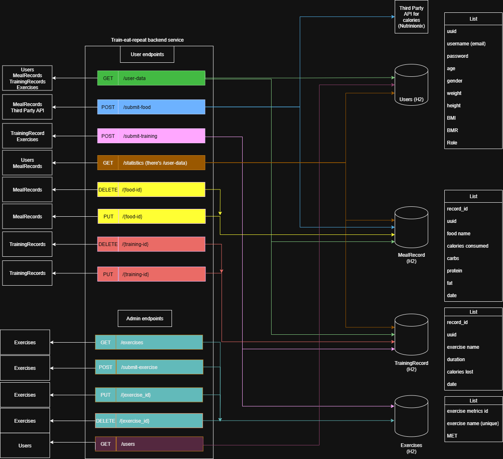

# TrainEatRepeat

---

## Table of Contents

- [About](#about)
- [Features](#features)
- [Getting Started](#getting-started)
    - [Prerequisites](#prerequisites)
    - [Installation](#installation)
    - [Configuration](#configuration)
- [Project Structure](#project-structure)
- [Tech Stack](#tech-stack)
- [Data Model](#data-model)
    - [SQL Tables](#sql-tables)
    - [Database logic with endpoints](#database-logic-with-endpoints)
- [Security](#security)
- [Contributing](#contributing)
- [Contact](#contact)

---

## About

**TrainEatRepeat** helps users track workouts, meals, and calorie data automatically. Designed for fitness enthusiasts, beginners, and everyone in between, it delivers actionable insights and stats to support your daily, weekly, and monthly routines.

---

## Features

- [x] **Training Tracking**  
  Log workouts (e.g., swimming, running, weightlifting) with automatic calorie burn estimation based on exercise type and duration.

- [x] **Meal Tracking**  
  Add foods and calculate calorie intake using real-time USDA FoodData Central API integration.

- [x] **Flexible Statistics**  
  View summaries and charts over daily, weekly, or monthly periods for both calories burned and consumed.

- [ ]  *(Future)* **Add nutritionist and trainer roles**
- [ ]  *(Future)* **Advanced Analytics Dashboard**

---

## Configuration

Adjust environment or edit `application.properties`:

```properties
usda.api.key=${USDA_API_KEY}
spring.mail.username=youremail@xyz.com
spring.mail.password=${EMAIL_PASSWORD}
```

Gmail App Passwords are recommended for secure email integration:
[Tutorial](https://www.youtube.com/watch?v=GsXyF5Zb5UY)

---

## Project Structure

```
TrainEatRepeat/
├── src/
│   ├── main/
│   │   ├── java/
│   │   │   └── org/
│   │   │       └── athletes/
│   │   │           └── traineatrepeat/
│   │   │               ├── api/
│   │   │               │   └── model/
│   │   │               ├── common/
│   │   │               ├── config/
│   │   │               ├── controller/
│   │   │               ├── converter/
│   │   │               ├── exception/
│   │   │               ├── model/
│   │   │               │   ├── request/
│   │   │               │   └── response/
│   │   │               ├── repository/
│   │   │               │   └── dto/
│   │   │               ├── service/
│   │   │               ├── util/
│   │   │               └── validation/
│   │   └── resources/
│   │       ├── db/
│   │       │   ├── h2/
│   │       │   └── migration/
│   │       ├── templates/
│   │       │   └── fragments/
│   │       └── application.properties
│   └── test/
│       └── java/
│           └── org/
│               └── athletes/
│                   └── traineatrepeat/
│                       └── service/
├── pom.xml
└── .gitignore
```

---

## Tech Stack

#### Backend
- Java 21+
- Spring Boot (REST API, Config)
- Spring MVC (Web)
- Spring WebFlux
- Spring Security
- Spring Data JPA (Hibernate ORM)
- Spring Validation
- Spring Boot Starter Mail
#### Databas & Migration
- H2 Database
- Flyway (Database Migration)
#### Templating
- Thymeleaf
- Thymeleaf Spring Security Extras
#### API Integration
- USDA FoodData Central API
#### Build & Tooling
- Maven
- Lombok
- Spotless
#### Testing
- Spring Boot Starter Test (JUnit and Mockito)
- Spring Security Test

---

## Data Model

### SQL Tables

- `USERS`: `UUID`, `USERNAME`, `PASSWORD`, `AGE`, `GENDER`, `WEIGHT`, `HEIGHT`, `BMI`, `BMR`, `ROLE`
- `TRAININGRECORDS`: `ID`, `UUID`, `EXERCISE`, `DURATION`, `CALORIES_LOST`, `DATE`
- `MEALRECORDS`: `ID`, `UUID`, `FOOD_NAME`, `CALORIES`, `CARBS`, `PROTEIN`, `FAT`, `DATE`
- `EXERCISES`: `ID`, `NAME`, `MET`

### Database logic with endpoints


---

## Security

- Spring Security for auth
- Passwords hashed with BCryptPasswordEncoder
- Secure API key storage using environment variables
- *(Future)*: JWT token-based authentication and refresh mechanism

---

## Getting Started

### Prerequisites

- Java 21+
- Maven
- H2 Database
- USDA API Key (free)
- Email account for notifications

### Installation

```bash
git clone https://github.com/JavaBootcampJuly2025/TrainEatRepeat.git
cd TrainEatRepeat

# Build with Maven
mvn clean install

# Run the app
java -jar target/train-eat-repeat.jar
```

---

## Contributing

1. Fork this repo
2. Create your feature branch (`git checkout -b feature/my-feature`)
3. Commit your changes (`git commit -m 'Add feature'`)
4. Push and create a PR

Follow Java naming and Spring Boot best practices. Javadoc preferred for services and controllers.

---

## Contact

Built by the **Java Bootcamp July 2025 TrainEatRepeat** team.  
For feedback, open an issue or discussion on [GitHub](https://github.com/JavaBootcampJuly2025/TrainEatRepeat/issues).

---